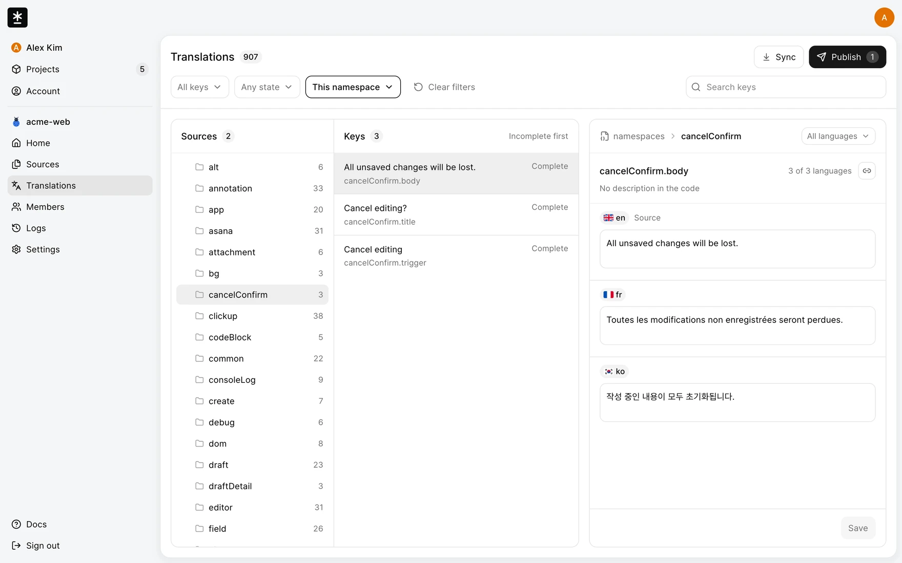
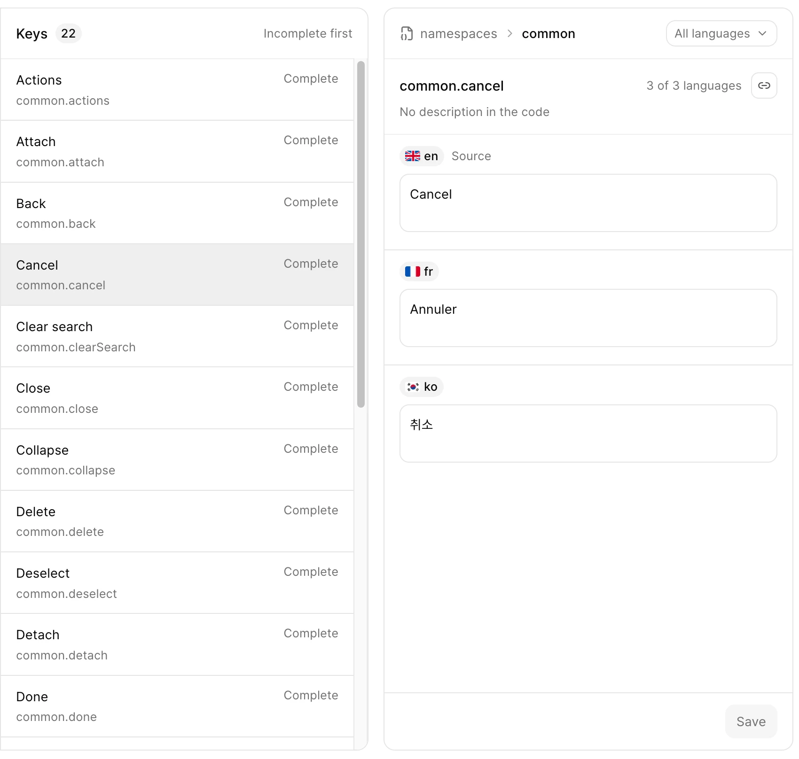
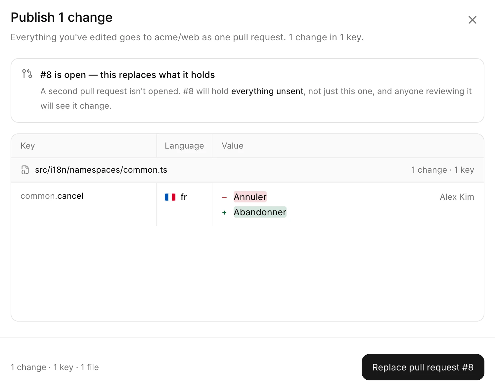
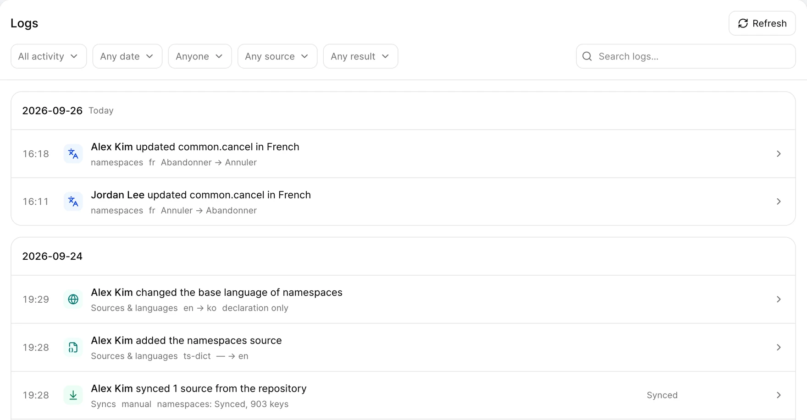
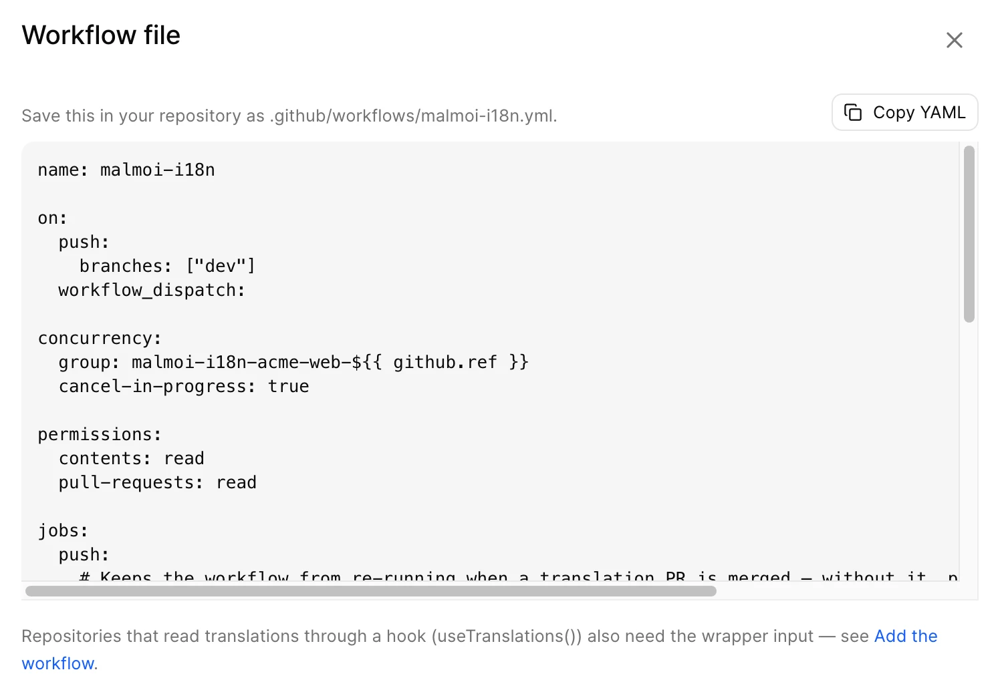

<h1 align="center">
  <a href="https://mal-moi.com"><picture><source media="(prefers-color-scheme: dark)" srcset="public/brand/malmoi-icon-white.svg" /></picture></a> Malmoi
</h1>

<p align="center">
  <a href="https://github.com/SinhyeokKang/malmoi/actions/workflows/ci.yml"></a>
  
  
</p>

<p align="center">
  <strong>Connect your projects, translate &amp; ship together.</strong><br/>
  Malmoi is a localization tool for GitHub repositories. It finds the translation files already in your repo,<br/>
  lets teammates edit them in the browser, and sends every change back as one pull request.
</p>

<h3 align="center"><a href="https://mal-moi.com"><ins>Open Malmoi</ins></a> · <a href="https://mal-moi.com/docs">Read the docs</a></h3>

<p align="center">
  
</p>

Translators never touch Git: they sign in, edit, and hit **Publish**.

## How it works

```text
                 push to the base branch (GitHub Actions)
  Repository  ──────────────────────────────────────────────▶  Malmoi
  decides which keys exist                         teammates edit values
      ▲                                                          │
      │            one pull request (Publish or nightly)         │
      └──────────────────────────────────────────────────────────┘
```

Connect a repository and Malmoi detects the translation files and loads them —
no commit needed before you see your strings. A generated workflow keeps it
current after that, and **Publish** sends saved edits back as one pull request.
The two sides are never merged: a push replaces Malmoi's values with the
repository's (unless edits are waiting), and Publish writes Malmoi's values
back.

[Get started →](https://mal-moi.com/docs/setup/create-project)

## Features

<table>
<tr>
<td width="50%" valign="middle">

### Find, then edit

A source tree and key list on one side, the selected key in every language on
the other. Search covers key names, source text, and saved translations, and
one **Save** writes every changed language of a key at once.

</td>
<td width="50%">
  
</td>
</tr>
<tr>
<td width="50%" valign="middle">

### Preview every change before it's sent

Publish lists each key × language change before it writes anything. An open
pull request is replaced instead of opening a second one. Publish never writes
to the base branch — merging stays with your reviewers.

</td>
<td width="50%">
  
</td>
</tr>
<tr>
<td width="50%" valign="middle">

### Every change, on the record

Logs records edits, syncs, and publishes with who made them and the value
before and after. History is kept for the life of the project.

</td>
<td width="50%">
  
</td>
</tr>
<tr>
<td width="50%" valign="middle">

### One workflow file

Malmoi generates the GitHub Actions workflow. Every push to the base branch
brings new keys into Malmoi and marks translations whose source text changed as
**Needs review** — unless unsent edits are holding syncing back.

</td>
<td width="50%">
  
</td>
</tr>
</table>

- **Unsent edits hold back syncing** — while any saved edit is unpublished, a
  workflow run loads nothing (its log says `deferred`). Publishing ends that
  hold, even before the pull request is merged. Only a project owner can
  discard unsent edits (Sync or Revert).
- **Removed keys are kept** — bring the code back and its translations return.
- **Nightly publishing** — saved changes nobody published go out once a night
  (18:00 UTC) for active, connected projects.

## Supported file formats

| Format | Example path |
| --- | --- |
| JSON catalog | `src/locales/{locale}.json` |
| YAML catalog | `config/locales/{locale}.yml` |
| Chrome extension messages | `_locales/{locale}/messages.json` |
| Code dictionary, one file per language | `src/locales/{locale}.ts` |
| Code dictionary, all languages in one file | `src/i18n/namespaces/*.ts` |

YAML catalogs and code dictionaries keep comments, blank lines, and key order;
JSON catalogs and Chrome messages keep indentation, one-line containers,
escapes, and field order. Values come from Malmoi. Detection needs at least two
languages.
[Limits →](https://mal-moi.com/docs/reference/limits)

## What Malmoi doesn't do

Malmoi is a pipeline between your repository and your team, not a translation
platform. These are deliberate omissions, not a roadmap:

- Translation memory, machine translation, or AI translation
- ICU plural and select syntax
- Approval workflows or fine-grained permissions
- Real-time co-editing, in-context editing, screenshots, translator notes

If you need those, a dedicated platform such as Crowdin or Tolgee is a better
fit.

## Under the hood

**Exports are deterministic.** The same database state produces byte-identical
files, so Publish can compare file hashes (Git blob SHAs) and commit only the
files that changed. A non-deterministic writer would open a meaningless pull
request every night.

**Commits come from the GitHub App, not from people.** Sign-in and repository
writes use separate GitHub credentials, so a translator leaving the
organization doesn't break the pipeline.

More in [`docs/ARCHITECTURE.md`](docs/ARCHITECTURE.md) (Korean).

## Privacy

Malmoi sends data to five services and no one else: GitHub, Google (if you sign
in with it), Supabase (database, Tokyo), Vercel (hosting, profile pictures), and Resend
(invitation emails, tracking off).
[Full policy →](https://mal-moi.com/privacy)

## Development

```bash
nvm use            # Node 24
pnpm install
cp .env.example .env.local   # fill in the values
pnpm db:generate
pnpm dev
```

Commands and conventions are in [`CLAUDE.md`](CLAUDE.md) (Korean, also the
agent instructions); product scope is in [`docs/PRODUCT.md`](docs/PRODUCT.md).
The engineering docs and source comments are in Korean — the project is built
by one person, and that's the language it was thought in.

## The name

*Malmoi* (말모이, "gathering words") was the 1910s project to
compile the first Korean dictionary — many people collecting scattered words
into one book.
