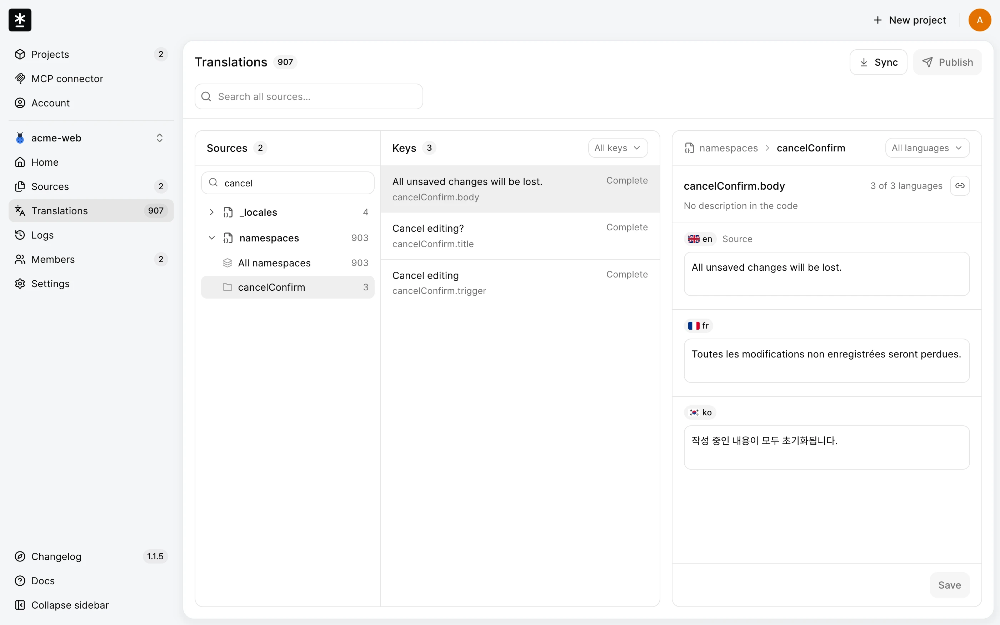
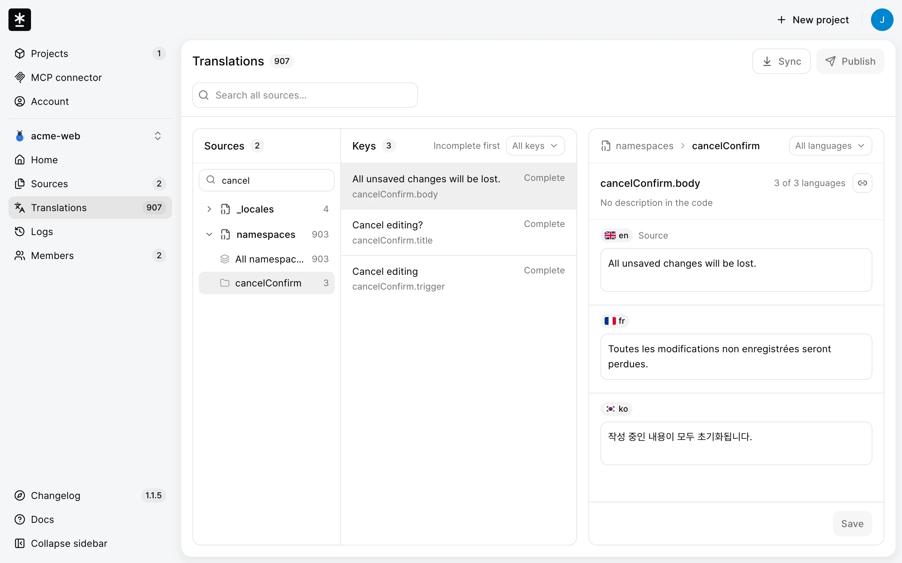
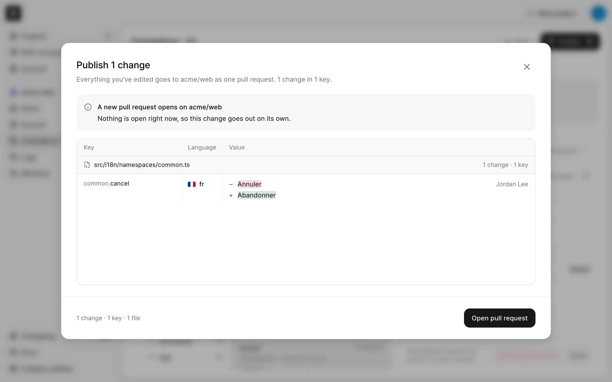
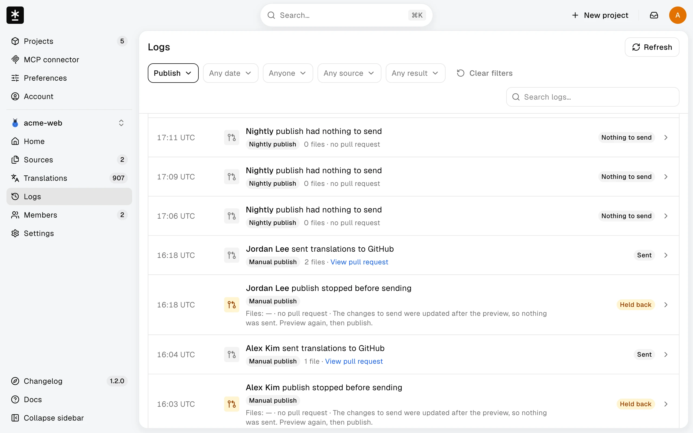
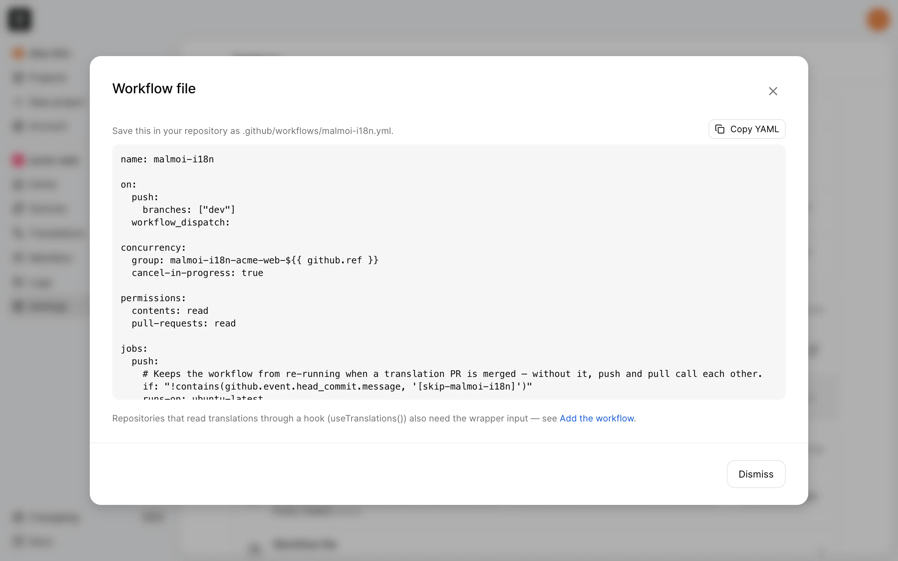

<h1>
  <a href="https://mal-moi.com"><picture><source media="(prefers-color-scheme: dark)" srcset="public/brand/malmoi-icon-white.svg" /></picture></a> Malmoi
</h1>

<p>
  <a href="https://github.com/SinhyeokKang/malmoi/releases/latest"></a>
  
  
  <a href="https://mal-moi.com/docs/ai-agents"></a>
  <a href="LICENSE"></a>
</p>

<p>
  <strong>Connect your projects, translate &amp; ship together.</strong><br/>
  Malmoi is a localization tool for GitHub repositories. It finds the translation files already in your repo,
  lets teammates edit them in the browser, and sends every change back as one pull request.
  Coding agents can do the same work over MCP — sign in through your browser, no token to copy.
</p>

<h3><a href="https://mal-moi.com"><ins>Get started</ins></a> · <a href="https://mal-moi.com/docs">Read the docs</a></h3>

<p>
  
</p>

Translators never touch Git: they sign in, edit, and hit **Publish**.

## How it works

```text
       push to the base branch (GitHub Actions) or nightly
  Repository  ──────────────────────────────────────────────▶  Malmoi
  decides which keys exist                         teammates edit values
      ▲                                                          │
      │            one pull request (Publish or nightly)         │
      └──────────────────────────────────────────────────────────┘
```

Connect a repository and Malmoi detects the translation files and loads them —
no commit needed before you see your strings. After that, a nightly sync picks
up new commits once a day, or an optional generated workflow delivers them on
every push, and **Publish** sends saved edits back as one pull request.
The two sides are never merged: an update replaces Malmoi's values with the
repository's (unless edits are waiting or a Malmoi pull request is still open),
and Publish writes Malmoi's values back.

[Create your first project →](https://mal-moi.com/docs/setup/create-project)

## Features

Search from either header for the docs; sign in to also find your projects, their pages, and their text, with key results limited to nonarchived projects and sources after the first sync, excluding removed keys and languages.

<table>
<tr>
<td width="50%" valign="middle">

### Find, then edit

A source tree and key list on one side, the selected key in every language on
the other. Search covers key names, source text, and saved translations, and
one **Save** writes every changed language of a key at once.

</td>
<td width="50%">
  
</td>
</tr>
<tr>
<td width="50%" valign="middle">

### Preview every change before it's sent

Publish lists each key × language change before it writes anything. An open
pull request is replaced instead of opening a second one. Publish never writes
to the base branch — merging stays with your reviewers.

</td>
<td width="50%">
  
</td>
</tr>
<tr>
<td width="50%" valign="middle">

### Every change, on the record

Logs records edits, syncs, and publishes with who made them and the value
before and after. History is kept for the life of the project.

</td>
<td width="50%">
  
</td>
</tr>
<tr>
<td width="50%" valign="middle">

### One workflow file

Malmoi generates the GitHub Actions workflow. Every push to the base branch
brings new keys into Malmoi and marks translations whose source text changed as
**Needs review** — unless unsent edits are holding syncing back. It also
collects code references, so each key shows where your code uses it.

</td>
<td width="50%">
  
</td>
</tr>
</table>

- **Unsent edits hold back syncing** — while any saved edit is unpublished, or
  a Malmoi pull request is still open, a repository update loads nothing (the
  workflow log says `deferred`). Merge or close the pull request and the next
  update goes through. Only a project owner can discard unsent edits (Sync or
  Revert).
- **Removed keys are kept** — bring the code back and its translations return.
- **Nightly sync** — once a night (18:00 UTC), for active, connected projects
  whose first sync has succeeded: saved changes nobody published go out as a
  pull request, and otherwise new commits on the base branch come in — so the
  workflow is optional, though only the workflow collects code references
  ([details](https://mal-moi.com/docs/sync/nightly)).
- **Two roles** — owners manage the repository, settings, and members; editors
  translate and publish. Invite teammates by email and pick a role per invite.
- **AI agents over MCP** — add the server URL to Claude Code, Codex, or a
  claude.ai custom connector and sign in through your browser: you choose what the app may do on a consent screen
  and never see or copy a token. Connected apps are listed on the MCP connector
  page, where you can disconnect each one. Clients that only take a header
  (such as Cursor) use a personal token that expires. Either way, the agent can
  do only what you can in each project, and only what you allowed; its edits
  are saved as yours.
  Malmoi itself never calls an AI model
  ([details](https://mal-moi.com/docs/ai-agents)).

## Supported file formats

| Format | Example path |
| --- | --- |
| JSON catalog | `src/locales/{locale}.json` |
| YAML catalog | `config/locales/{locale}.yml` |
| Chrome extension messages | `_locales/{locale}/messages.json` |
| Code dictionary, one file per language | `src/locales/{locale}.ts` |
| Code dictionary, all languages in one file | `src/i18n/namespaces/*.ts` |

YAML catalogs and code dictionaries keep comments, blank lines, and key order;
JSON catalogs and Chrome messages keep indentation, one-line containers,
escapes, and field order. Values come from Malmoi. Detection supports a single language, so you can edit source text before adding translations. One project can hold several sources, in any mix of formats; Publish
sends them in one pull request.
[Limits →](https://mal-moi.com/docs/reference/limits)

## What Malmoi doesn't do

Malmoi is a pipeline between your repository and your team, not a translation
platform. These are deliberate omissions, not a roadmap:

- Translation memory, machine translation, or AI translation
- ICU plural and select syntax
- Approval workflows or fine-grained permissions
- Real-time co-editing, in-context editing, screenshots, translator notes

If you need those, a dedicated platform such as Crowdin or Tolgee is a better
fit.

## Under the hood

**Exports are deterministic.** The same database state produces byte-identical
files, so Publish can compare file hashes (Git blob SHAs) and commit only the
files that changed. A non-deterministic writer would open a meaningless pull
request every night.

**Commits come from the GitHub App, not from people.** Sign-in and repository
writes use separate GitHub credentials, so a translator leaving the
organization doesn't break the pipeline.

More in [`docs/ARCHITECTURE.md`](docs/ARCHITECTURE.md) (Korean).

## Privacy

Malmoi sends data to five services and no one else: GitHub, Google (if you sign
in with it), Supabase (database, Tokyo), Vercel (hosting, profile and project pictures, cookieless page-view counts on the public pages), and Resend
(invitation emails, tracking off).
[Full policy →](https://mal-moi.com/privacy)

## Development

```bash
nvm use            # Node 24
pnpm install
cp .env.example .env.local   # fill in the values
pnpm db:generate
pnpm dev
```

Commands and conventions are in [`CLAUDE.md`](CLAUDE.md) (Korean, also the
agent instructions); product scope is in [`docs/PRODUCT.md`](docs/PRODUCT.md).
The engineering docs and source comments are in Korean — the project is built
by one person, and that's the language it was thought in.

## License

[MIT](LICENSE) © 2026 Sinhyeok Kang
